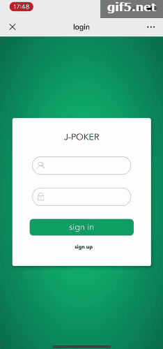
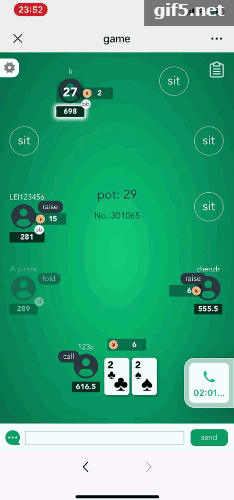

# Texas Poker Game

This is an online Texas Hold'em game, base on TypeScript,Egg,Node.js,Vue

## Server

base on midway.js,TypeScript, socket.io, mysql.

Detail: [server-readme](./server/README.md)

## Client

base on vue-cli, TypeScript, socket.io.

Detail: [client-readme](./client/README.md)

## Project structure

``` plain
├─client
├─database
│  └─poker.sql
└─server
```

## Demo







## License

The MIT License (MIT)
